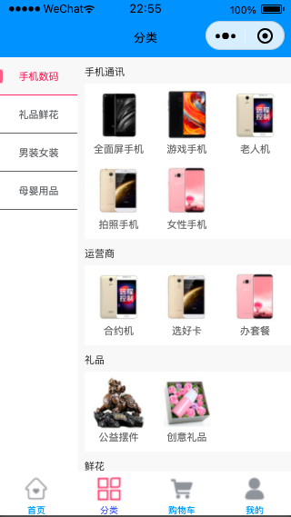
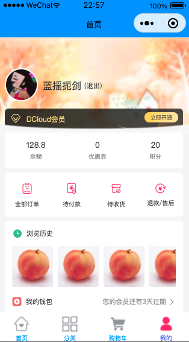

# uni-app + vue3.x + pinia

## 简介

`uni-app + vue3.x` 项目工程化搭建，集成 `ESLint`、`Prettier`、`Stylelint`、`husky`、`lint-staged` 、`commitlint`等，

同时实现了 pinia 在 uniapp 中的持久化插件[pinia-plugin-persist-uni](https://github.com/Allen-1998/pinia-plugin-persist-uni)以及 storeToRefs 增强插件[pinia-auto-refs](https://github.com/Allen-1998/pinia-auto-refs)。

## 使用说明

```javascript

   pnpm install
   
   npm run serve
  
```
欢迎使用和点亮小星星。







## todo
  
   1. 订单
   2. 收货地址
   4. 详情
   5. 其他
  
